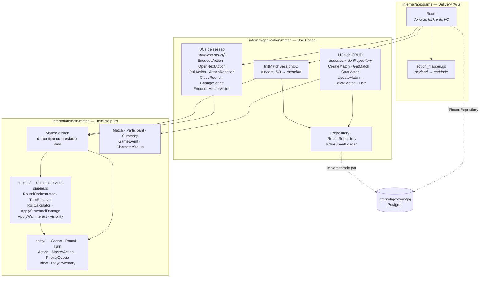
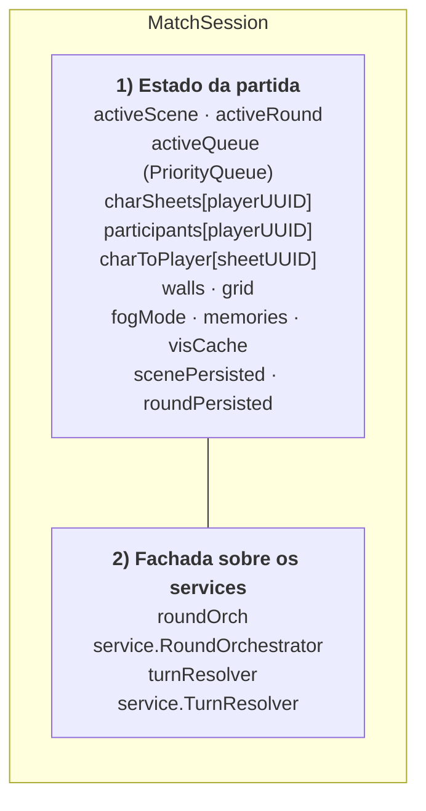
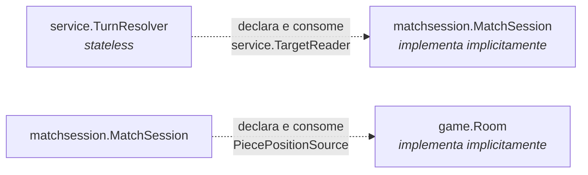

# 01 — Mapa de módulos: `domain/match` e `application/match`

## Visão em três anéis



**Regra de dependência:** `entity ← domain ← application ← delivery`, e `entity ← gateway`.
Nada em `domain/` importa `application/` ou `app/`.

## A tradução OOP → go-way que já aconteceu neste domínio

Você vem de OOP; `character_sheet/` ainda reflete isso (objetos gordos, `I_*` interfaces
declaradas junto do provedor, métodos que fazem e guardam). O `match/` já foi refatorado
para o outro paradigma. A tabela abaixo é o dicionário entre os dois:

| Instinto OOP | Como ficou em `match/` | Por quê |
|---|---|---|
| `Round` sabe abrir/fechar seus turnos | `RoundOrchestrator.NextAction(r *round.Round, q *PriorityQueue)` | A regra é do *sistema*, não do dado. O `Round` só guarda `turns`, `mode`, `createdAt`. |
| `Turn.Resolve()` calcula seu resultado | `TurnResolver.Resolve(t, sheets, targets) *TurnResolution` | Resolver precisa de fichas e do mapa — coisas que o `Turn` não deveria conhecer. |
| Um `MatchEngine` singleton com tudo dentro | `MatchSession` (só estado) + services (só regra) | Estado e regra separados: dá para testar regra sem montar partida. |
| Interface `I_Foo` ao lado de `Foo` | `service.TargetReader`, `matchsession.PiecePositionSource` | **Interface declarada por quem consome**, com o mínimo de métodos. Ver abaixo. |
| Herança / classe base | Composição por ponteiro opcional em `Action` (`Move`, `Attack`, `Dodge`, `Interact` — todos `*T`) | Uma `Action` é a *combinação* dos componentes presentes, não uma subclasse. |

## `MatchSession`: o que ela realmente é

Domain services são stateless por decisão de design — então alguém precisa segurar o estado
vivo da partida. É a `MatchSession` (`internal/domain/match/matchsession/`).
Ela é **duas coisas ao mesmo tempo**, e vale enxergar isso separado:



Todo método público da sessão segue o mesmo formato: **pega o estado que o service precisa,
chama o service, guarda o resultado de volta**. Ex.:

```go
func (s *MatchSession) AttachReaction(r *action.Action) (*service.TurnResolution, error) {
    if err := s.roundOrch.AttachReaction(s.activeRound, r); err != nil { return nil, err }
    t := s.activeRound.CurrentTurn()
    return s.turnResolver.Resolve(t, s.charSheets, s)   // ← `s` entra como TargetReader
}
```

Isso é a resposta prática para "domain service é stateless, então onde mora o estado?":
mora na sessão, e a sessão é a única que sabe montar os argumentos dos services.

## As duas interfaces invertidas (o padrão mais go-way daqui)



- **`service.TargetReader`** (`turn_resolver.go:24`) — `CategorizeTarget` + `GetWall`.
  Existe porque `service/` não pode importar `matchsession/` (import cíclico: a sessão já
  importa os services). A sessão implementa sem declarar nada.
- **`matchsession.PiecePositionSource`** (`match_session.go:23`) — `PlayerPiecePositions`.
  Existe porque as posições das peças vivem no `Room` (camada de delivery, payloads de WS)
  e a sessão precisa delas para calcular LOS sem importar delivery. `Room.SetPieceSource`
  injeta na hora do `StartMatch`.

Nos dois casos: **interface pequena, no pacote que usa, satisfeita implicitamente**.
É exatamente o inverso do `I_Skill`/`I_Proficiency` de `character_sheet/`.

## Os dois sabores de use case em `application/match`

```mermaid
flowchart TB
    subgraph a["Sabor A — UC de sessão (7 deles)"]
        A1["type OpenNextActionUC struct{}"] --> A2["Execute(ctx, session, masterUUID, callerUUID)"]
        A2 --> A3["1. autorização: callerUUID == masterUUID?"]
        A3 --> A4["2. delega: session.OpenNextAction()"]
        A4 --> A5["3. embrulha em *Result"]
    end
    subgraph b["Sabor B — UC de CRUD (9 deles)"]
        B1["type CreateMatchUC struct{ repo IRepository }"] --> B2["CreateMatch(ctx, input)"]
        B2 --> B3["1. validação de invariantes"]
        B3 --> B4["2. entidade de domínio"]
        B4 --> B5["3. repo.CreateMatch(ctx, m)"]
    end
```



O sabor A **não faz I/O e não guarda a sessão** — recebe `*MatchSession` como parâmetro em
todo `Execute`. Quem é dono dela é o `Room`. A única responsabilidade real desses UCs hoje é
**política de autorização** (`callerUUID != masterUUID → ErrNotMatchMaster`) — a regra de jogo
está toda no domínio, o I/O está todo no `Room`. É uma camada fina de propósito.

Exceções ao sabor A: `CloseRoundUC` (tem `IRoundRepository` — persiste o fechamento) e
`InitMatchSessionUC` (é a fábrica: lê DB e constrói a sessão).

## Onde cada arquivo vive

```
internal/domain/match/
├── match.go, participant.go, summary.go, game_event.go   ← agregado + read models
├── character_status.go                                   ← ⚠️ só design em comentário; nada usa
├── matchsession/
│   ├── match_session.go     ← O estado vivo + fachada
│   └── session_data.go      ← ActiveSessionData (DTO de hidratação do DB)
├── entity/
│   ├── action/    Action, MasterAction, ActionSpeed, RollCheck, RollContext,
│   │              RollCondition, Skill, Attack, Defense, Dodge, Move, Interact,
│   │              Trigger, Velocity, Initiative, PriorityQueue
│   ├── battle/    Blow                    ← ⚠️ campos todos privados e não preenchidos
│   ├── round/     Round, GameEvent
│   ├── scene/     Scene
│   ├── turn/      Turn
│   └── fog/       FogMode, PlayerMemory
└── service/
    ├── round_orchestrator.go   ciclo Round/Turn
    ├── turn_resolver.go        resolução do Turn        ← ⚠️ maior parte é TODO
    ├── roll_calculator.go      cálculo de rolagem       ← ⚠️ retorna 0; ninguém chama
    ├── structural_damage.go    dano em parede
    ├── wall_interact.go        abrir/fechar/trancar
    ├── visibility.go           LOS por varredura angular
    ├── filter_map_state.go     política de visibilidade
    └── mask_secret_door.go     máscara de porta secreta

internal/application/match/
├── i_repository.go        IRepository + IRoundRepository
├── i_session_loader.go    ICharSheetLoader
├── init_match_session.go  ← a fábrica da sessão
├── enqueue_action.go, open_next_action.go, pull_action.go,
│   attach_reaction.go, close_round.go, change_scene.go,
│   enqueue_master_action.go                              ← sabor A
└── create/get/update/delete/start/list_*.go              ← sabor B
```
