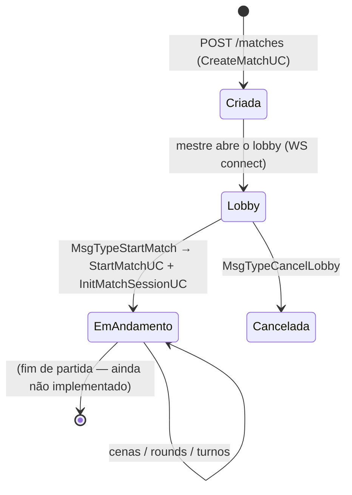
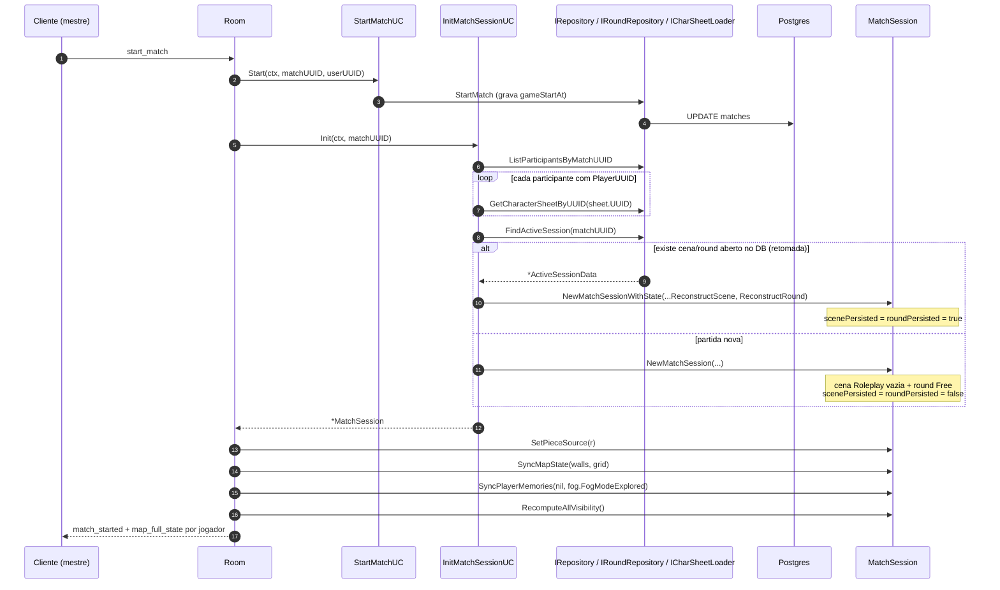
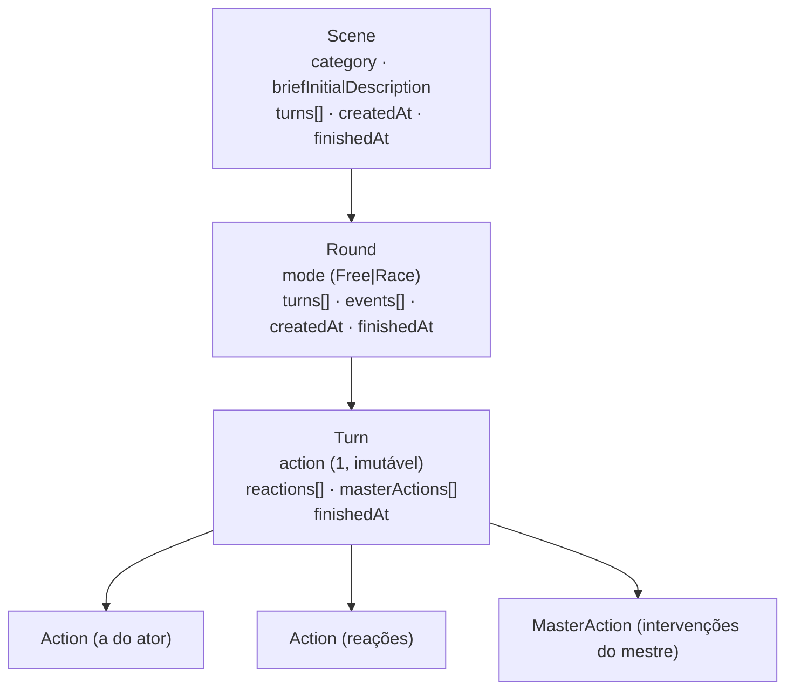
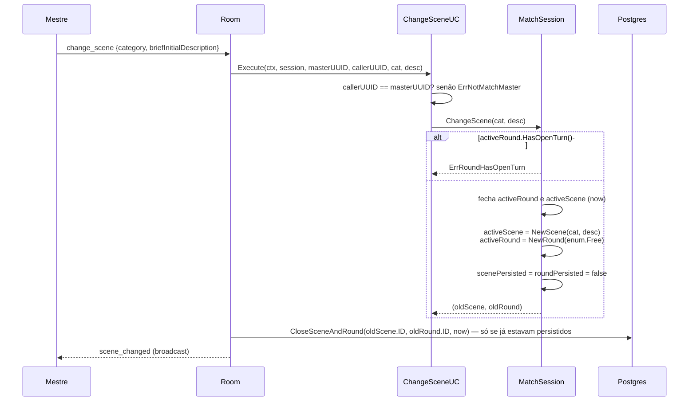

# 02 — Ciclo de vida da partida

## Estados

Antes de `StartMatch`, `Room.session == nil`. Toda mensagem de jogo responde
`match_not_started`. O lobby já mexe em peças e paredes (`piece_moved`, `map_state_sync`),
mas isso vive em `Room`, não na sessão.

## `start_match`: a fábrica da sessão

Dois detalhes que importam:

- **`charSheets` (e `statuses`) é chaveado por `sheetUUID`, não por `playerUUID`.** As
  **peças do tabuleiro carregam o `sheetUUID`** como `CharacterID`, e é por esse eixo que a
  ficha e o estado de combate vivo são buscados. `participants` continua chaveado por
  `playerUUID` (autorização é por jogador); o mapa auxiliar `charToPlayer[sheetUUID] =
  playerUUID` é a ponte entre os dois eixos toda vez que o fluxo cruza tabuleiro ↔ jogador.
- **A sessão nasce com uma cena e um round já abertos.** Não existe estado "sem cena".
  Cena inicial: `enum.Roleplay` com descrição vazia; round inicial: `enum.Free`.

## Cena → Round → Turno: a hierarquia viva

A sessão mantém **exatamente um** `activeScene` e **exatamente um** `activeRound`.
O "turno atual" é sempre `activeRound.CurrentTurn()` — o último da fatia. Não há índice
nem ponteiro separado: `HasOpenTurn()` é `CurrentTurn() != nil && finishedAt == nil`.

## `change_scene`

Note que a cena nova **sempre volta para `Free`**, mesmo que a anterior estivesse em `Race`.

## `close_round`

`CloseRoundUC` fecha o round atual e **abre um novo já preservando o `mode`**
(`round.NewRound(mode)`), marcando `roundPersisted = false`. Persiste via
`IRoundRepository.CloseRound` apenas se o round fechado já existia no banco.
Erro de persistência é engolido (`_ = dbErr // log in production`) — a partida em memória
segue em frente.
