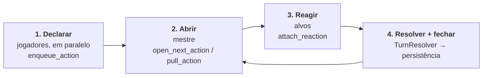
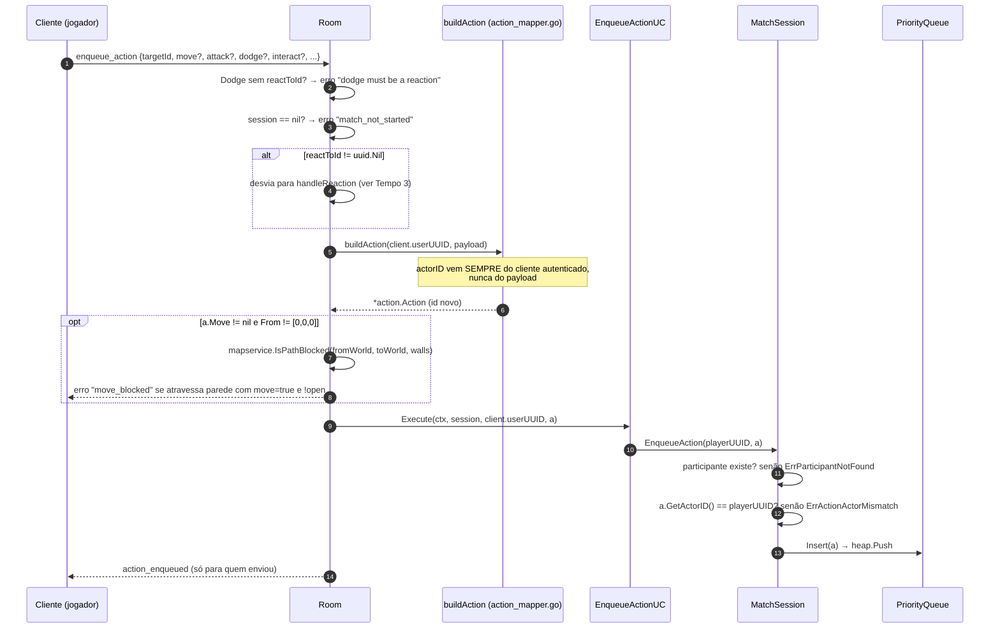
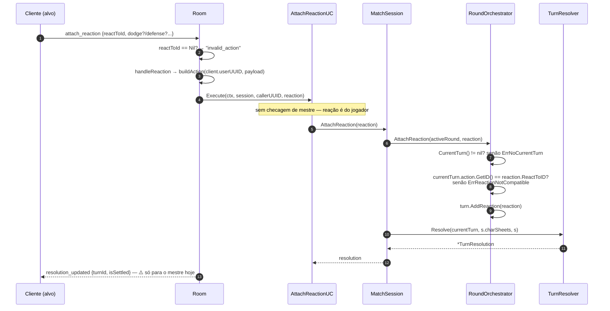
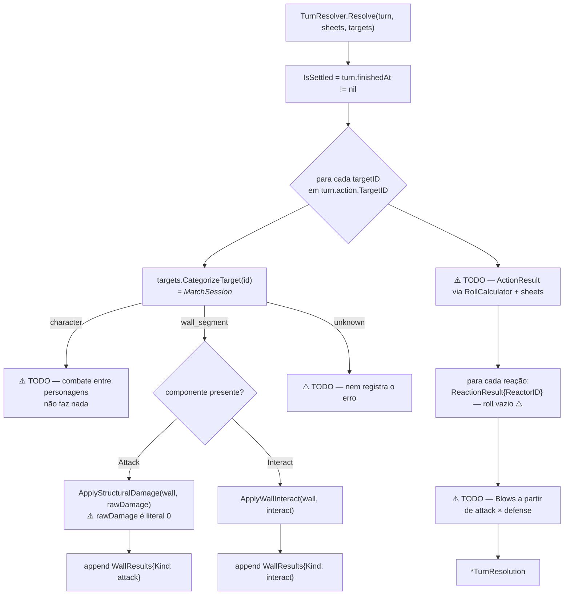

# 03 — Fluxo de ação

O coração do produto: jogadores **declaram intenção em paralelo**, o mestre **abre** as
ações na ordem certa, o sistema **resolve** os números. Este documento mapeia o caminho
que existe hoje, ponta a ponta.

## Visão geral — os quatro tempos



O paralelismo do tempo 1 é o que mata a latência de mesa: ninguém espera a vez para
*pensar*. A fila de prioridade é o que devolve a ordem correta no tempo 2.

## Tempo 1 — declarar (`enqueue_action`)



**A fila.** `action.PriorityQueue` é um max-heap sobre `container/heap`, ordenado por
`Action.Speed.Result` (`priority_queue.go:14`). Operações: `Insert`, `ExtractMax`,
`ExtractByID`, `Peek`, `IsEmpty`. A fila vive dentro da `MatchSession` (`activeQueue`) e
**não é persistida** — é intenção declarada, morre com o processo.

> ⚠️ Hoje `buildAction` passa `action.ActionSpeed{}` fixo, então **todo item entra na fila com
> `Speed.Result == 0`** e a ordem é a ordem interna do heap, não a velocidade do personagem.
> A fila de prioridade está montada e correta; só não tem prioridade para ordenar. Ver `05`.

## Tempo 2 — abrir (`open_next_action` / `pull_action`)

Só o mestre. `open_next_action` pega o topo da fila; `pull_action` pega uma ação específica
por UUID (é o "eu quero resolver essa primeiro" do mestre).

```mermaid
sequenceDiagram
    autonumber
    participant M as Cliente (mestre)
    participant R as Room
    participant UC as OpenNextActionUC
    participant S as MatchSession
    participant RO as RoundOrchestrator
    participant TR as TurnResolver
    participant DB as Postgres

    M->>R: open_next_action
    R->>R: IsMaster(client.userUUID)? senão "forbidden"
    R->>UC: Execute(ctx, session, masterUUID, callerUUID)
    UC->>UC: callerUUID == masterUUID? senão ErrNotMatchMaster
    UC->>S: OpenNextAction()
    opt activeRound.HasOpenTurn()
        S->>RO: CloseTurn(activeRound, now) → closed
    end
    S->>RO: NextAction(activeRound, &activeQueue)
    RO->>RO: q.ExtractMax()  (nil → ErrQueueEmpty)
    RO->>RO: turn.NewTurn(*next); round.AppendTurn(t)
    RO-->>S: opened *Turn
    S-->>UC: (closed, opened)
    UC->>TR: Resolve(opened, nil, session)
    Note over UC,TR: ⚠️ passa `nil` no lugar de session.charSheets
    UC-->>R: {ClosedTurn, OpenedTurn, Resolution}

    opt ClosedTurn != nil
        R->>DB: PersistTurnClose(scene, round, closedTurn, closedAction, matchUUID)
        R->>S: MarkRoundPersisted()
    end
    R-->>M: turn_opened {turnId, actorId} (broadcast a todos)
    opt Resolution.WallResults não vazio
        R->>R: broadcastWallResults → wall_hp_changed / wall_state_changed
    end
```

`pull_action` é idêntico, trocando `ExtractMax()` por `ExtractByID(actionID)`
(`ErrActionNotFound` se não achar).

**O turno anterior também fecha no momento em que o próximo abre** — isso não mudou. O que
mudou na Fase 5: agora também existe um fechamento **explícito**, sem abrir o próximo. A
mensagem WS `close_turn` chama `MatchSession.CloseOpenTurn()` (sucessora de
`MatchSession.CloseTurn()`, que este fluxo descrevia antes de a Fase 5 apagá-la — ela pulava
`closeOpenTurn` e não resolvia, não aplicava dano nem avançava os ledgers) e recusa fechar
enquanto houver reação anexada e nunca aberta, a menos que o mestre confirme com
`{"confirm": true}`. Ver `combat-engine.md` § "O que a Fase 5 fixou no motor".

## Tempo 3 — reagir (`attach_reaction`)



Uma reação é **a mesma `Action`** com `ReactToID` preenchido. Não há tipo separado —
o roteamento é por presença de campo. A validação de compatibilidade é uma só:
a reação tem que apontar para a ação do turno **atualmente aberto**.

## Tempo 4 — resolver (`TurnResolver`)

É aqui que o motor deveria calcular. Hoje ele só roteia por tipo de alvo:



`TurnResolution` é o formato de saída já acordado — vale conhecê-lo, porque é o contrato
que o motor vai preencher:

```go
type TurnResolution struct {
    ActionResult    RollResult        // { SkillName, SkillValue, DiceRolled []int, Total }
    ReactionResults []ReactionResult  // { ReactorID, Roll RollResult }
    Blows           []*battle.Blow    // colisão ataque × defesa
    WallResults     []WallResult      // { UpdatedWall, EffectiveDamage, ReboundDamage, Kind }
    IsSettled       bool              // o turno já fechou?
}
```

**Só o ramo de parede funciona ponta a ponta hoje** (e mesmo ele com dano fixo em 0).
O ramo de personagem — que é o combate de verdade — está vazio.

## O canal paralelo: `enqueue_master_action`

O mestre não entra na fila de prioridade. `MasterAction` é anexada **direto ao turno aberto**:

```mermaid
sequenceDiagram
    participant M as Mestre
    participant R as Room
    participant UC as EnqueueMasterActionUC
    participant S as MatchSession
    participant T as Turn (aberto)

    M->>R: enqueue_master_action {targetIds, skills?, move?, attack?, interact?}
    opt Interact.Kind == "reveal"
        R->>R: revealSecretDoors(targetIDs) — in-memory + broadcast, fora da fila
    end
    opt Interact open/close/toggle sobre parede
        R->>R: applyWallInteract + broadcastWallStateChangedGated
    end
    R->>UC: Execute(ctx, session, masterUUID, callerUUID, ma)
    UC->>S: EnqueueMasterAction(ma)
    S->>S: CurrentTurn() aberto? senão ErrNoActiveTurn
    S->>T: SetHappenedAt(now); AddMasterAction(ma)
    R-->>M: master_action_enqueued (broadcast)
```

Duas rotas para interação com parede convivem: **mestre** resolve *in-memory no `Room`* e
transmite na hora; **jogador** passa pela fila e só resolve quando o mestre abre o turno.
É deliberado — o mestre não espera a fila.

## Mensagens WS envolvidas (resumo)

| Direção | Tipo | Quem pode |
|---|---|---|
| C→S | `enqueue_action` | jogador (e mestre) |
| C→S | `attach_reaction` | qualquer participante |
| C→S | `open_next_action` | mestre |
| C→S | `pull_action` | mestre |
| C→S | `enqueue_master_action` | mestre |
| C→S | `change_scene` | mestre |
| S→C | `action_enqueued` | só o remetente |
| S→C | `turn_opened` | broadcast |
| S→C | `resolution_updated` | ⚠️ só mestre |
| S→C | `master_action_enqueued` | broadcast |
| S→C | `scene_changed` | broadcast |
| S→C | `wall_hp_changed`, `wall_state_changed` | filtrado por LOS |
| S→C | `round_closed` | declarado, **sem emissor** ⚠️ |
