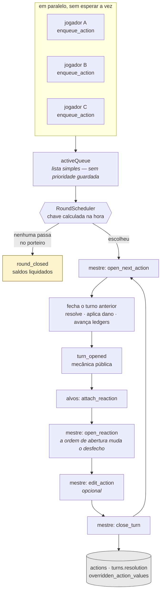
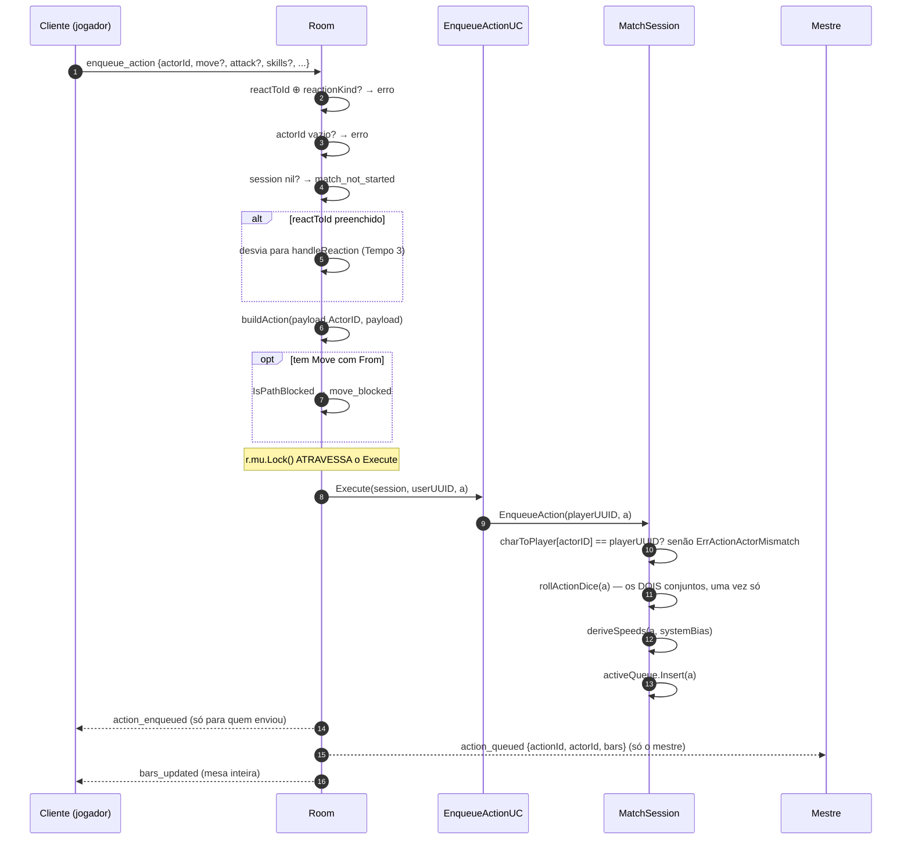
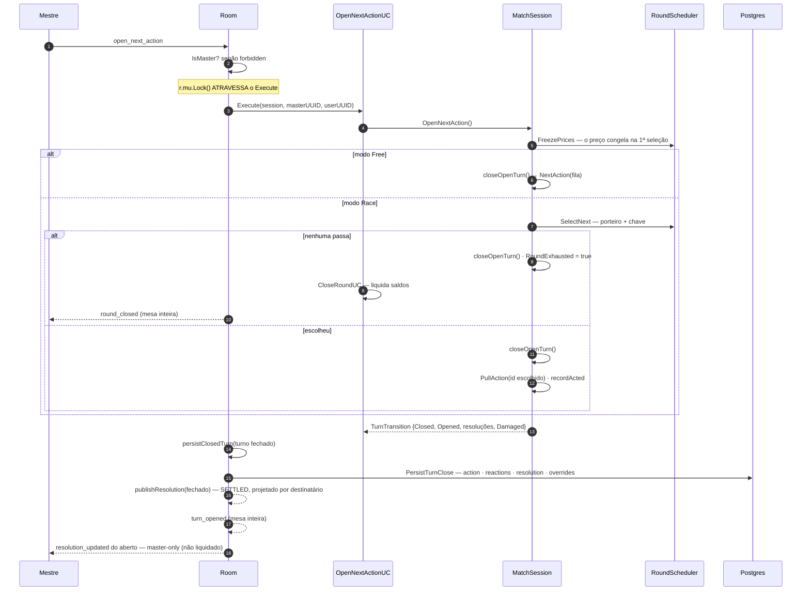
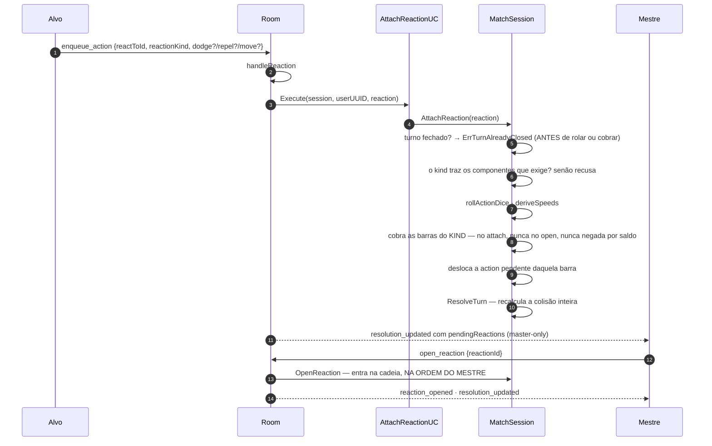
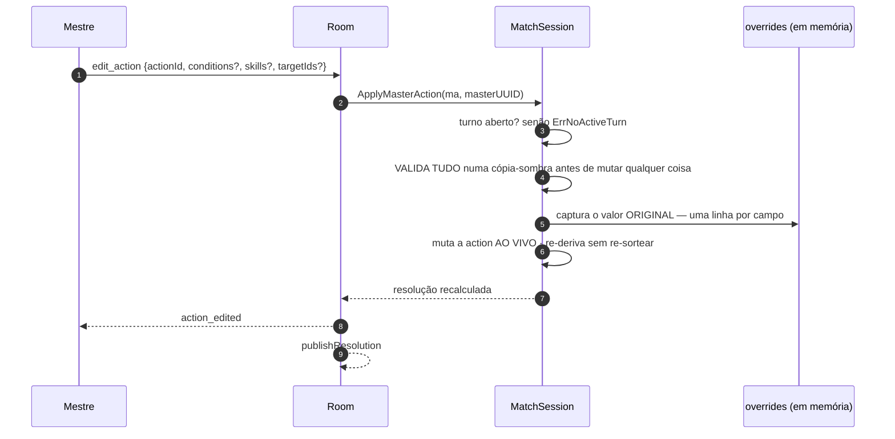
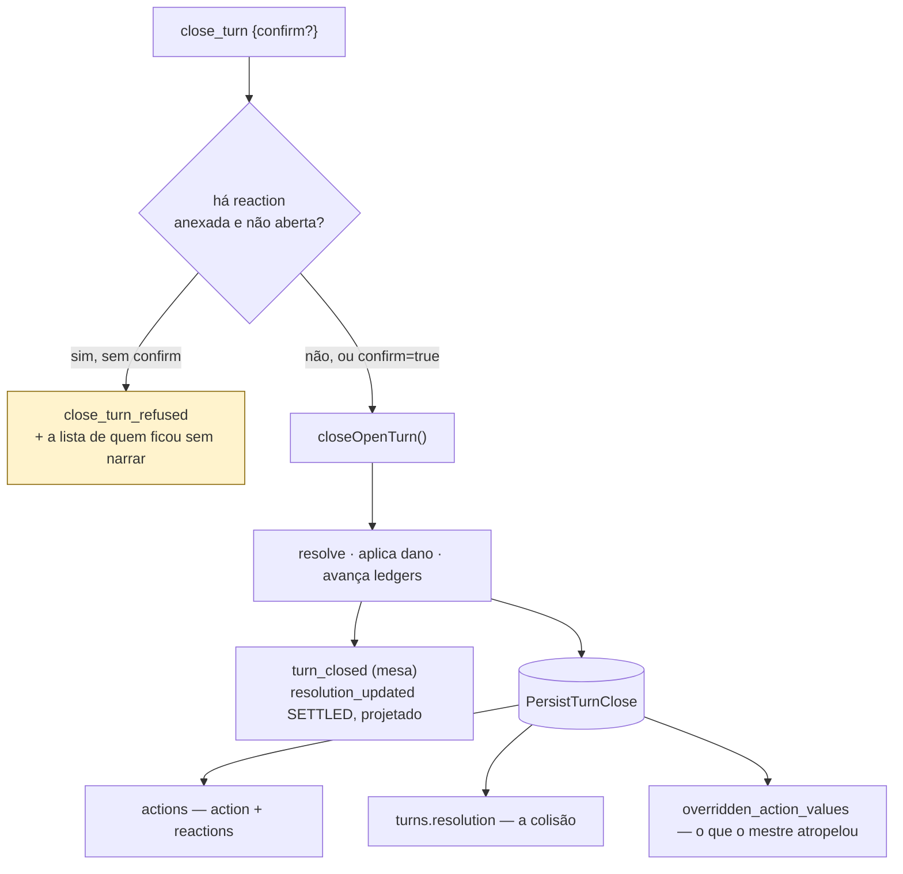
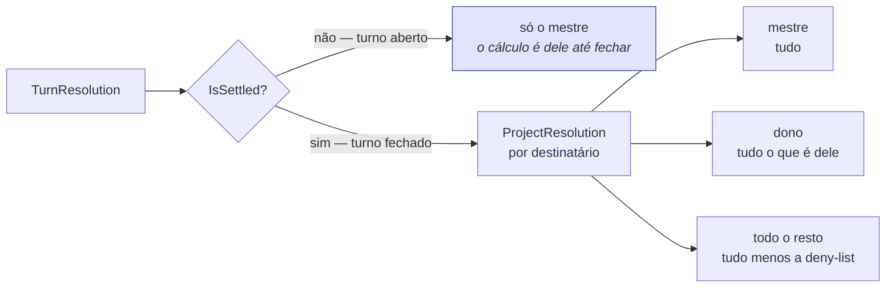

# 03 — Fluxo de ação

> Estado do código na Fase 5. Não é design aspiracional: cada seta abaixo existe.

O coração do produto: jogadores **declaram intenção em paralelo**, o mestre **abre** as ações
na ordem certa, o sistema **resolve** os números. Ninguém espera a vez para *pensar* — é isso
que mata a latência de mesa.

## Os verbos de hoje

| Mensagem | Quem pode | O que faz |
|---|---|---|
| `enqueue_action` | jogador (do próprio personagem) | declara; rola os dados na chegada; entra na fila |
| `attach_reaction` | jogador alvo | responde ao ataque aberto; cobra barra; recalcula |
| `open_next_action` | mestre | fecha o turno anterior e abre o próximo da ordem |
| `pull_action` | mestre | abre **esta** action, fora de ordem, sem porteiro |
| `open_reaction` | mestre | dá a palavra a uma reaction anexada — **a ordem muda o resultado** |
| `edit_action` | mestre | edita a action aberta; recalcula sem re-sortear |
| `close_turn` | mestre | encerra de propósito; recusa se há reaction não aberta |
| `change_round_mode` | mestre | `Free` ⇄ `Race` |

> `enqueue_action` com `reactToId` preenchido **é** o `attach_reaction`: `room.go` desvia para
> `handleReaction`. Os dois campos viajam juntos ou nenhum — `reactToId` diz *"isto é reação"*
> e `reactionKind` diz *o que custa*.

## Visão geral

**Não existe verbo de confirmação.** O mestre edita, a resolução recalcula na hora, e **passar
o bastão é a confirmação** — abrir a próxima, abrir uma reaction, fechar o turno. Não dá para
seguir em frente e continuar deliberando ao mesmo tempo.

## Tempo 1 — declarar

**`actorID` é o `sheetUUID`**, não o do jogador. A autorização é `charToPlayer[actorID] ==
playerUUID` — é assim que um mestre pode agir por um NPC sem que um jogador possa agir pelo
personagem de outro.

**`action_queued` é master-only e existe por um motivo estrutural:** sem ele o mestre não tem
como aprender o ID de uma action pendente, e `pull_action` fica inalcançável de um cliente
real. *Um ID que o cliente não consegue aprender é uma operação que o cliente não consegue
invocar.*

**A fila não guarda prioridade.** `activeQueue` é lista simples. A chave de ordenação muda
quando o personagem manda outra action (a média se move), e um heap não suporta re-chavear um
item já inserido — quebraria em silêncio. A chave é calculada na hora da seleção.

## Tempo 2 — abrir

**São dois porteiros, não um:**

| | Porteiro |
|---|---|
| 1ª action do personagem no round | a **barra** alcança o preço: `carry + rolagem ≥ preço` |
| 2ª em diante | o **troco** das que já agiram alcança o preço |

**`closeOpenTurn` é o coração.** Ele resolve, **aplica o dano nas fichas** e avança os ledgers
— nessa ordem, para que um modificador que valia neste turno ainda conte. Toda rota que fecha
turno passa por ele.

**`pull_action` reusa a mesma operação, sem porteiro.** Antecipar uma action é prerrogativa do
mestre.

## Tempo 3 — reagir

**O custo sai do tipo declarado, não da forma.** Os três escapes carregam exatamente os mesmos
campos e custam três coisas diferentes:

| `ReactionKind` | Barra de ação | Barra de movimento |
|---|---|---|
| `nothing`, `dodge`, `closedDodge` | — | — |
| `repel` | ✔ | — |
| `closedEscape` | — | ✔ |
| `escape`, `escapeGuard` | ✔ | ✔ |

**Uma reaction anexada e não aberta NÃO vira passo da cadeia.** É deliberado: se ela afetasse a
colisão antes de o mestre dar a palavra, a ordem de abertura deixaria de importar — e a ordem
importar *é* o poder de jogo desta fase.

## Tempo 4 — editar

**A action editada É a action.** Não existe versão paralela para mesclar na leitura — todo
consumidor lê um lugar só. O preço disso: *"o que o jogador mandou"* deixa de ser algo que se
lê e passa a ser algo que se **reconstrói**, pela tabela de sobrepostos.

**Valida antes de mutar.** Uma falha no meio do laço deixava meia edição aplicada e reportava
fracasso puro — o mestre acreditava não ter mudado nada.

**Reverter sai de graça.** Uma linha por **campo**, guardando o original. Editar de volta ao
valor original apaga a captura e não grava linha nenhuma. É isso que dispensa um verbo de
confirmação: o que um "confirmar" daria de real seria *cancelar*.

**A edição muda o desfecho, nunca a economia.** Barras cobradas, `Speeds` registrados e ordem
já jogada ficam como estão.

## Tempo 5 — fechar

Essas reactions **entram no cálculo**; o que elas perdem é o momento de narrar. É por isso que
a confirmação existe — e ela é **computada pelo servidor**, não uma cortesia do cliente.

## Quem vê o quê

**Dois eixos, não um:** *tempo* (`IsSettled`) e *classe* (mestre / dono / resto). **O alvo não
é classe** — uma finta contra você não te conta que era finta.

**O rótulo é o vazamento:** `closedDodge` chega a terceiros como `dodge`, `closedEscape` como
`escape`. Deduzir da barra pública é legítimo — o escape fechado cobra uma barra onde o padrão
cobra duas. Ser avisado de graça pelo rótulo não é.

## Referências

Regras e o porquê de cada decisão: [`../combat-engine.md`](../combat-engine.md).
O que ainda está oco: [`05-lacunas.md`](05-lacunas.md).
