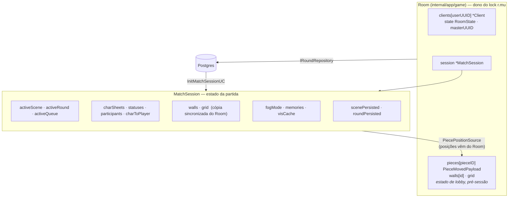
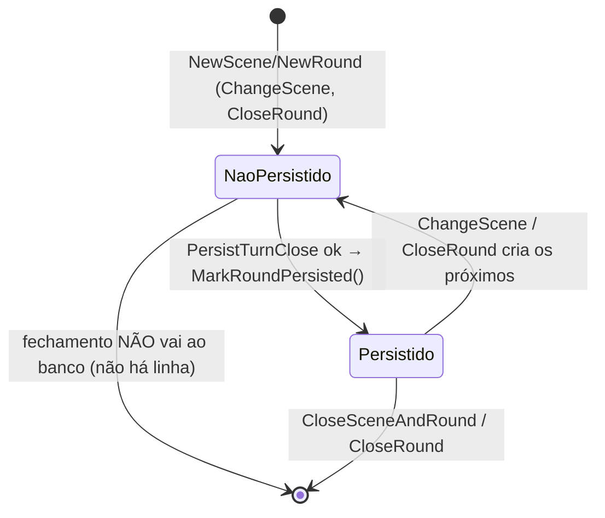

# 04 — Estado e persistência

## Quem é dono de quê

**`MatchSession` não tem lock próprio.** `room.go` é a única serialização: quem tocar na
sessão precisa segurar `r.mu` (leitura ou escrita conforme o caso). Isso está documentado em
`.github/instructions/game-server.instructions.md` e é fácil de violar — todo `Execute` novo
que receber a sessão herda essa obrigação.

## O que sobrevive a um restart

| Estado | Persistido? | Onde |
|---|---|---|
| `Match` (título, datas, público) | ✅ | `matches` |
| `Participant` / enrollment | ✅ | `enrollments` + `character_sheets` |
| `Scene` (id, categoria, descrição, createdAt/finishedAt) | ✅ | via `PersistTurnClose` / `CloseSceneAndRound` |
| `Round` (id, mode, createdAt/finishedAt) | ✅ | idem |
| `Turn` **fechado**, sua `Action` **e suas reactions** | ✅ | `PersistTurnClose` (atômico) |
| `TurnResolution` **liquidada** | ✅ | `turns.resolution` JSONB — a colisão, não só a declaração |
| Valores que o mestre sobrepôs | ✅ | `overridden_action_values`, drenados do `MatchSession` na mesma transação |
| HP após o dano | ✅ | `UpdateStatusBars`, nas **duas** rotas que fecham turno |
| `Turn` **aberto** | ❌ | só memória |
| `activeQueue` (ações declaradas, não abertas) | ❌ | **morre com o processo** |
| `MasterAction`s do turno | ❌ | só memória — o que sobrevive é o *valor atropelado*, não o ato |
| Dados de perícia removida pelo mestre | ⚠️ | vivem na memória enquanto o turno está aberto; no fechamento vão para `overridden_action_values`, **nunca** para o histórico da action |
| `Action.Interact` e `Action.SystemBias` | ❌ | **sem coluna** — ver `05-lacunas.md` |
| `visCache` (polígonos de LOS) | ❌ | recalculado |
| `PlayerMemory` (fog explored) | ⚠️ parcial | `SyncPlayerMemories(nil, ...)` no start — repositório ainda não plugado |

> **A resolução persistida é a do fechamento.** Ela é recalculada a cada reaction e a cada
> edição do mestre; a que vale é a que teve o dano aplicado, nunca um dry-run.

> **Falha de persistência é logada e engolida, por desenho.** O turno já fechou em memória e a
> mesa não pode parar. Um teste que queira provar que algo foi gravado tem que olhar o banco,
> não o retorno da operação.
| Peças no tabuleiro | ✅ (lobby) | `match_maps`; em partida o `Room` é a fonte viva |

**Consequência prática:** um restart no meio de um round perde todas as intenções
declaradas. A partida rehidrata na cena/round corretos (`FindActiveSession`), mas com a fila
vazia e sem turno aberto. É aceitável hoje; vira problema quando a fila tiver peso de jogo.

## As flags de persistência

`scenePersisted` / `roundPersisted` resolvem um problema específico: a cena e o round são
criados **em memória primeiro** e só chegam ao banco quando o primeiro turno fecha
(`PersistTurnClose` grava cena+round+turno+ação numa transação). Antes disso, tentar um
`UPDATE ... SET finished_at` falharia — a linha não existe.

`NewMatchSessionWithState` (retomada) nasce com as duas flags em `true`, porque veio do banco.
`NewMatchSession` (partida nova) nasce com as duas em `false`.

## Onde o I/O acontece

O domínio não faz I/O. Os UCs de sessão também não — **exceto `CloseRoundUC`**. Quem escreve
no banco durante o jogo é o `Room`:

| Gatilho | Chamada | Camada |
|---|---|---|
| turno fecha (dentro de `open_next_action`/`pull_action`) | `IRoundRepository.PersistTurnClose` | `Room` |
| `change_scene` | `IRoundRepository.CloseSceneAndRound` | `Room` |
| fechar round | `IRoundRepository.CloseRound` | `CloseRoundUC`, chamado por `OpenNextActionUC` quando nenhuma pendente passa no porteiro |
| `start_match` | `IRepository.StartMatch` | `StartMatchUC` |

Erros de persistência durante o jogo são **logados e ignorados** — a partida em memória é a
autoridade em runtime. É uma escolha consciente (não travar a mesa por causa do banco), mas
significa que divergência memória↔banco passa silenciosa.
