# 05 — Lacunas: o que falta para a partida ganhar vida

Levantamento do que está **oco** hoje. Não é backlog priorizado — é o mapa do terreno antes
de decidir por onde cavar.

## O desenho geral: o esqueleto está pronto, o músculo não

```mermaid
flowchart LR
    subgraph ok["✅ Funciona ponta a ponta"]
        A["Fila de prioridade<br/>(estrutura)"]
        B["Ciclo Scene/Round/Turn"]
        C["Reação anexada e validada"]
        D["Persistência de turno fechado"]
        E["Paredes: dano estrutural<br/>+ interact + LOS/fog"]
        F["RollCalculator + colisão<br/>personagem (Fase 2)"]
        G["Dano na ficha, no<br/>fechamento do turno"]
    end
    subgraph gap["⚠️ Existe como tipo, não como comportamento"]
        I["Initiative"]
        J["CharacterStatus / barras"]
        K["ActionSpeed alimentando a fila"]
    end
    ok -.->|"o motor de rolagem e a colisão<br/>atravessaram na Fase 2"| gap
```

## 1. ✅ O motor de rolagem está ligado ao turno (Fase 2)

`RollCalculator` sorteia e deriva desde a Fase 1. A Fase 2 fez a fiação:

- **`MatchSession.rollActionDice`** derruba os dados no instante em que a action ou reaction
  chega (`EnqueueAction`, `AttachReaction`) e os guarda em `action.RollCheck.Attempts`.
- **`TurnResolver.Resolve` virou função pura do turno** — deriva, nunca rola. É o que permite
  recalcular a colisão a cada reaction e a cada edição do mestre sem re-sortear.
- **`RollSource`** é o ponto de injeção: `nil` = produção (crypto/rand), teste passa uma fonte
  roteirizada. `MatchSession.SetRollSource` existe só para os testes.

As duas fricções que a Fase 1 contornou foram enfrentadas:

- **`RollCheck.SkillName` é `string`, a ficha indexa por `enum.SkillName`.** A conversão mora
  agora na fronteira do WS (`buildAction` rejeita nome inválido com erro de WS) e, defensiva-
  mente, em `service.skillValueOf`, que devolve 0 para um nome que a ficha não conhece em vez
  de derrubar a resolução inteira.
- **`RollContext.GetDiceResult(d die.Die)` ignora o parâmetro `d`.** Continua como está e
  **segue sem chamador**: o motor lê `RollCheck.Attempts`, não `RollContext`.

## 2. A fila de prioridade não tem prioridade

`PriorityQueue.Less` compara `Action.Speed.Result`. Mas `buildAction` (`action_mapper.go:38`)
passa `action.ActionSpeed{}` literal — `ActionSpeedPayload` chega do cliente e é descartado.
Resultado: **toda ação entra com `Speed.Result == 0`** e o heap devolve ordem arbitrária.

O `open_next_action` do mestre funciona, mas "a mais rápida primeiro" ainda não é verdade.

## 3. ✅ `TurnResolver`: o ramo `character` (Fase 2)

O ramo resolve acerto → esquiva por reflexo passiva → defesa passiva → dano, e produz um
`CharacterResult` por alvo, com os dados individuais, os totais, as flags de crítico, a margem
derivada e o dano **projetado**. `res.Blows` é populado; `battle.Blow` ganhou construtor e
acessores.

**Os dois eixos foram reconciliados.** `Action.actorID` passou a ser o `sheetUUID` — o mesmo
ID que a peça carrega como `CharacterID` e o mesmo que um `TargetID` carrega —, então o
resolver indexa ator e alvo no mesmo mapa. `ActionPayload.actorId` é obrigatório no wire, e a
autorização continua por jogador: `EnqueueAction` verifica
`charToPlayer[actorCharID] == playerUUID`.

Ataque a parede também deixou de usar `rawDamage := 0`: rola os dados da arma como qualquer
outro dano.

Segue pendente no mesmo arquivo:

- `TargetKindUnknown` não registra erro nenhum para o chamador.
- Ficha ausente para ator ou alvo é ignorada em silêncio, sem reportar.
- `ReactionResult` só carrega `ReactorID`; `Roll` fica vazio — Fase 4.

## 4. ✅ `buildAction` mapeia o payload inteiro (Fase 2)

`Skills`, `Speed`, `Feint`, `Attack` (com `Weapon`, `Hit`, `Damage`, `Charge`), `Defense`,
`Move.Speed/Charge` — tudo mapeado. Nome de perícia e nome de arma passam por
`enum.SkillNameFrom` / `enum.WeaponNameFrom` e um valor desconhecido volta como erro de WS,
em vez de virar zero silencioso lá no fundo do resolver.

O mapper **não rola**: os dados caem na sessão, depois que a action é aceita.

`buildMasterAction` continua ignorando `Move` e `Attack` — segue **deferred to Phase 4**.

## 5. Iniciativa e modo `Race` não estão ligados

`RoundOrchestrator.ChangeMode(r, initiative)` **ignora o parâmetro `initiative`** e só faz
`r.ToggleMode()`. Nenhum UC e nenhuma mensagem WS chamam esse método. A entidade
`action.Initiative` tem `targetID` e `skills` privados, sem construtor. Ou seja:
`enum.Race` existe como valor, mas não há caminho para entrar nele.

## 6. `CharacterStatus` virou código, mas ainda não é consumido

`internal/domain/match/character_status.go` deixou de ser só o comentário de design — a
Fase 1 transformou o racional em struct: `ActionBar`/`MoveBar` (`ResourceBar`, saldo +
velocidades roladas no round), `Ledger` (`ModifierLedger`, os bônus/penalidades
acumulados) e `Stance` (reservado — as regras de postura ainda não existem, todo
personagem é `StanceNone`). `Velocity` também está lá, herdado do desenho de movimento.

`Position` ficou de fora **de propósito**: posições moram no `Room` (chegam nos payloads
WS) e a sessão já as alcança via `matchsession.PiecePositionSource` — duplicar aqui criaria
uma segunda fonte de verdade enquanto o mapa continuasse desenhando a cópia do `Room`.

O bloco de ~150 linhas de comentário com o racional de movimento, barras, clash, footwork,
investida e aproximação quickness↔aceleração continua no arquivo, verbatim — segue sendo a
fonte mais rica de intenção de produto que existe no repositório, mesmo com o struct já
existindo ao lado dele.

O próprio comentário registra a decisão: *"O CharacterStatus não será persistido — precisa ser
construído dinamicamente a partir das actions"*. Isso continua sendo uma escolha arquitetural
pendente (projeção derivada de eventos), não um TODO simples — a Fase 1 não decidiu isso, só
deu forma ao struct.

## 7. Buracos no ciclo do round

- **`CloseRoundUC` não está plugado em nada.** Não há `MsgTypeCloseRound`, nem campo no `Room`,
  nem construtor chamado. O round só termina indiretamente, via `change_scene`.
- **`MsgTypeRoundClosed` está declarado e nunca é emitido.**
- **`MatchSession.CloseTurn()`** existe e nenhuma rota a chama (fechar turno acontece
  implicitamente dentro de `OpenNextAction`/`PullAction`).

## 8. Visibilidade da resolução

- `resolution_updated` leva payload de verdade desde a Fase 2 — `TurnID`, os dados
  individuais, o total, as flags de crítico, a margem e o dano projetado por alvo — mas
  continua **só para o mestre**, e isso é deliberado: o cálculo é dele até o turno encerrar.
  Quem reagiu ainda não recebe confirmação nenhuma.
- Isso está listado em `AGENTS.md` como *deferred to Phase 4*: "players see reactions only when
  master reveals".

## 9. ✅ Um caminho só para `Resolve` (Fase 2)

`OpenNextAction`, `PullAction` e `AttachReaction` passam todos por
`MatchSession.ResolveTurn`, que monta o `service.ResolveInput` com as fichas, as regras da
partida e o catálogo de armas. Os UCs não instanciam mais um resolver próprio nem passam
`nil` no lugar das fichas.

As duas operações do bastão do mestre devolvem um `matchsession.TurnTransition` — turno
fechado, turno aberto, a resolução de cada um e o que o fechamento aplicou de fato.

## 9b. ✅ Serialização das rotas de sessão (Fase 2)

As quatro rotas que mexem na sessão (`enqueue_action`, `attach_reaction`,
`open_next_action`, `pull_action`) soltavam o `RLock` antes de chamar o use case — protegiam
o ponteiro, não o estado. Agora seguram o **write lock durante o `Execute`**, como
`game-server.instructions.md` sempre mandou. `TestE2E_AttackAgainstACharacterProducesDamage`
roda sob `-race` e é a rede de segurança.

## 10. Fila e reação: pontos de decisão em aberto

Não são bugs — são decisões de design ainda não tomadas, que o desenho do fluxo precisa
resolver:

- Como um jogador sabe que **precisa reagir**? Hoje `turn_opened` vai em broadcast com
  `{turnId, actorId}` e nada mais — não diz quem são os alvos.
- **Janela de reação**: o turno pode fechar enquanto uma reação está sendo composta.
  Não há timeout, trava nem confirmação.
- **Reações múltiplas** ao mesmo turno são aceitas sem limite e sem ordenação.
- Uma ação enfileirada **não pode ser cancelada nem editada** — não há `ExtractByID` exposto
  ao jogador dono da ação.
- `Action.openedAt` / `confirmedAt` existem no struct, são privados e **nunca são setados**.
  Havia intenção de um handshake de confirmação.

---

## Resumo em uma frase

O ciclo **Scene → Round → Turn → Action/Reaction** está completo e testado, e desde a Fase 2
o **motor que transforma isso em números** atravessa inteiro: `RollCalculator` →
`TurnResolver` → `Blow` → dano na ficha. O que falta agora não é o vão, são as camadas em
cima dele — a economia das barras (Fase 3), as reações ativas e a cadeia com vários alvos
(Fase 4), a regência e a visibilidade por destinatário (Fase 5), e o front (Fase 6).
