# 05 — Lacunas: o que falta para a partida ganhar vida

Levantamento do que está **oco** hoje. Não é backlog priorizado — é o mapa do terreno antes
de decidir por onde cavar.

## O desenho geral: o esqueleto está pronto, o músculo não

```mermaid
flowchart LR
    subgraph ok["✅ Funciona ponta a ponta"]
        A["Fila de prioridade<br/>(estrutura)"]
        B["Ciclo Scene/Round/Turn"]
        C["Reação anexada e validada"]
        D["Persistência de turno fechado"]
        E["Paredes: dano estrutural<br/>+ interact + LOS/fog"]
    end
    subgraph gap["⚠️ Existe como tipo, não como comportamento"]
        F["RollCalculator"]
        G["TurnResolver (ramo personagem)"]
        H["Blow"]
        I["Initiative"]
        J["CharacterStatus / barras"]
        K["ActionSpeed no wire"]
    end
    ok -.->|"o que separa os dois lados<br/>é o motor de rolagem"| gap
```



## 1. O motor de rolagem existe, mas ainda não está ligado ao turno

`RollCalculator` (Fase 1) já sorteia e deriva: `Roll` lança os dois conjuntos de dados uma
vez, quando a action ou reaction chega; `Derive` recalcula o resultado a partir desse
sorteio, quantas vezes o mestre editar, e devolve `RollOutcome` com os dados individuais,
o total, crítico e erro crítico. O que falta é a fiação — **nem `TurnResolver`, nem a
sessão, nem os UCs o chamam**. Sem essa ligação, `RollCheck.Result` nunca é preenchido, e
tudo que depende de um número (ordem da fila, acerto, dano, esquiva) segue inerte. Ligar o
`RollCalculator` ao ramo `character` do `TurnResolver` é trabalho de Fase 2.

Peças que já existem para essa ligação:
- `die.Die` com `Roll()` (crypto/rand com fallback), `enum.DieSides` D4…D100.
- `RollCheck { Context RollContext; SkillName; SkillValue; Result }`.
- `RollContext { Dice []die.Die; Condition *RollCondition; Result *int }`.
- `RollCondition { Bias int (vantagem/desvantagem, acumula); Modifier int; Description }`.
- Ficha: `CharacterSheet.GetValueForTestOfSkill(enum.SkillName)` e
  `GetValueForTestOfAttribute(enum.AttributeName)`.

Fricção conhecida: `RollCheck.SkillName` é `string`, mas a ficha indexa por
`enum.SkillName` — falta a conversão/validação na fronteira. E
`RollContext.GetDiceResult(d die.Die)` ignora o parâmetro `d` e soma todos os dados. A
Fase 1 contornou as duas: `RollCalculator.RollInput.SkillValue` recebe o valor **já
resolvido** pelo chamador, então o motor não indexa a ficha nem lê `RollContext` — a Fase 2,
ao fazer essa ligação de verdade, é quem vai ter que enfrentar as duas.

## 2. A fila de prioridade não tem prioridade

`PriorityQueue.Less` compara `Action.Speed.Result`. Mas `buildAction` (`action_mapper.go:38`)
passa `action.ActionSpeed{}` literal — `ActionSpeedPayload` chega do cliente e é descartado.
Resultado: **toda ação entra com `Speed.Result == 0`** e o heap devolve ordem arbitrária.

O `open_next_action` do mestre funciona, mas "a mais rápida primeiro" ainda não é verdade.

## 3. `TurnResolver`: o ramo `character` está vazio

```
case TargetKindCharacter:
    // TODO: implement character combat rolls (existing path)
```

Também pendentes no mesmo arquivo:
- `ActionResult` nunca é calculado (`res.ActionResult` fica zero).
- `ReactionResult` só carrega `ReactorID`; `Roll` fica vazio.
- `Blows` nunca é populado — `battle.Blow` tem todos os campos privados e nenhum construtor.
- `TargetKindUnknown` não registra erro nenhum para o chamador.
- Ataque a parede usa `rawDamage := 0` literal — o dano do `Attack.Damage` nunca é rolado.

**Os dois eixos, ator e alvo, hoje discordam.** `buildAction(client.userUUID, payload)`
(`action_mapper.go`) põe `ActorID` como o **jogador** autenticado, e
`MatchSession.EnqueueAction` reforça isso: `a.GetActorID() == playerUUID` é obrigatório. Mas
`TargetID` (`[]uuid.UUID`) carrega **sheetUUIDs** — e, desde o rekey da Fase 1, é por `sheetUUID` que
`charSheets` e `statuses` são indexados. Isso deixa `TurnResolver.Resolve` com um mapa que
sabe indexar pelo alvo mas não pelo ator: `sheets[a.GetActorID()]` compila e devolve `nil`
para sempre, porque a chave é um `playerUUID` num mapa de `sheetUUID`. A ponte que existe,
`charToPlayer`, roda no sentido errado para esse uso (sheetUUID → playerUUID), e com um
mestre controlando vários personagens o inverso nem é uma função — um `playerUUID` pode
corresponder a mais de um `sheetUUID`. Reconciliar os dois eixos (ou fazer o `TurnResolver`
resolver o `sheetUUID` do ator antes de indexar) é trabalho da Fase 2, quando o ramo
`character` deixar de estar vazio.

## 4. `buildAction` descarta metade do payload

O contrato WS (`ActionPayload`) já carrega `Skills`, `Speed`, `Feint`, `Attack`, `Defense`,
`Move.Speed/Charge`. O mapper monta apenas `Move` (categoria + posições), `Dodge` (categoria +
nome da perícia) e `Interact`. O resto vira `nil`.

Mesmo problema em `buildMasterAction`: `Move` e `Attack` são explicitamente ignorados.

**Isso significa que o contrato do front já é mais rico que o backend consome.** Antes de
mexer no mapper, vale conferir o que o front realmente envia hoje.

## 5. Iniciativa e modo `Race` não estão ligados

`RoundOrchestrator.ChangeMode(r, initiative)` **ignora o parâmetro `initiative`** e só faz
`r.ToggleMode()`. Nenhum UC e nenhuma mensagem WS chamam esse método. A entidade
`action.Initiative` tem `targetID` e `skills` privados, sem construtor. Ou seja:
`enum.Race` existe como valor, mas não há caminho para entrar nele.

## 6. `CharacterStatus` virou código, mas ainda não é consumido

`internal/domain/match/character_status.go` deixou de ser só o comentário de design — a
Fase 1 transformou o racional em struct: `ActionBar`/`MoveBar` (`ResourceBar`, saldo +
velocidades roladas no round), `Ledger` (`ModifierLedger`, os bônus/penalidades
acumulados) e `Stance` (reservado — as regras de postura ainda não existem, todo
personagem é `StanceNone`). `Velocity` também está lá, herdado do desenho de movimento.

`Position` ficou de fora **de propósito**: posições moram no `Room` (chegam nos payloads
WS) e a sessão já as alcança via `matchsession.PiecePositionSource` — duplicar aqui criaria
uma segunda fonte de verdade enquanto o mapa continuasse desenhando a cópia do `Room`.

O bloco de ~150 linhas de comentário com o racional de movimento, barras, clash, footwork,
investida e aproximação quickness↔aceleração continua no arquivo, verbatim — segue sendo a
fonte mais rica de intenção de produto que existe no repositório, mesmo com o struct já
existindo ao lado dele.

O próprio comentário registra a decisão: *"O CharacterStatus não será persistido — precisa ser
construído dinamicamente a partir das actions"*. Isso continua sendo uma escolha arquitetural
pendente (projeção derivada de eventos), não um TODO simples — a Fase 1 não decidiu isso, só
deu forma ao struct.

## 7. Buracos no ciclo do round

- **`CloseRoundUC` não está plugado em nada.** Não há `MsgTypeCloseRound`, nem campo no `Room`,
  nem construtor chamado. O round só termina indiretamente, via `change_scene`.
- **`MsgTypeRoundClosed` está declarado e nunca é emitido.**
- **`MatchSession.CloseTurn()`** existe e nenhuma rota a chama (fechar turno acontece
  implicitamente dentro de `OpenNextAction`/`PullAction`).

## 8. Visibilidade da resolução

- `resolution_updated` vai **só para o mestre** (`room.go:827`), e o payload preenche apenas
  `IsSettled` — `TurnID` fica `uuid.Nil`. Quem reagiu não recebe confirmação nenhuma.
- Isso está listado em `AGENTS.md` como *deferred to Phase 4*: "players see reactions only when
  master reveals".

## 9. Inconsistência: dois caminhos para `Resolve`

| Caminho | Chamada |
|---|---|
| `AttachReaction` | `session.AttachReaction` → `turnResolver.Resolve(t, s.charSheets, s)` — `s.charSheets` agora é chaveado por `sheetUUID` (Fase 1), não mais por `playerUUID` |
| `OpenNextAction` / `PullAction` | UC chama `service.TurnResolver{}.Resolve(opened, nil, session)` |

O segundo passa `nil` no lugar das fichas e instancia um resolver novo em vez de usar o da
sessão. Hoje é inócuo (o resolver ignora `sheets`), mas no minuto em que o motor de rolagem
entrar, abrir um turno resolverá sem ficha nenhuma. **Candidato natural a virar
`session.OpenNextAction()` devolvendo a resolução, como já faz `AttachReaction`.**

## 10. Fila e reação: pontos de decisão em aberto

Não são bugs — são decisões de design ainda não tomadas, que o desenho do fluxo precisa
resolver:

- Como um jogador sabe que **precisa reagir**? Hoje `turn_opened` vai em broadcast com
  `{turnId, actorId}` e nada mais — não diz quem são os alvos.
- **Janela de reação**: o turno pode fechar enquanto uma reação está sendo composta.
  Não há timeout, trava nem confirmação.
- **Reações múltiplas** ao mesmo turno são aceitas sem limite e sem ordenação.
- Uma ação enfileirada **não pode ser cancelada nem editada** — não há `ExtractByID` exposto
  ao jogador dono da ação.
- `Action.openedAt` / `confirmedAt` existem no struct, são privados e **nunca são setados**.
  Havia intenção de um handshake de confirmação.

---

## Resumo em uma frase

O ciclo **Scene → Round → Turn → Action/Reaction** está completo e testado; o **motor que
transforma isso em números** — `RollCalculator` (Fase 1, já rola e deriva) → `TurnResolver`
→ `Blow` → efeito na ficha — só tem a primeira peça pronta, e nada a chama. É esse o vão a
atravessar.
